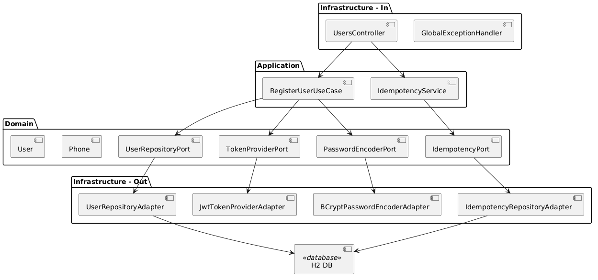
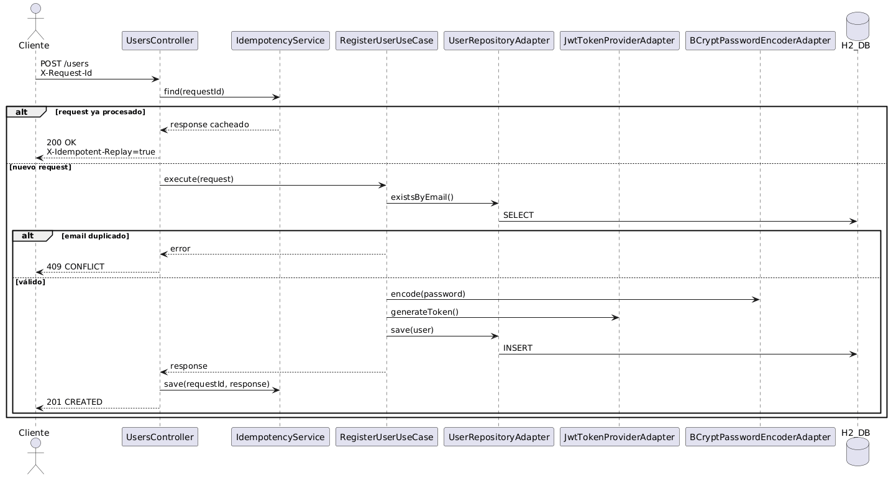

# Users Microservice
Microservicio desarrollado con Spring Boot 3 + WebFlux + JPA bajo arquitectura hexagonal.

## Tecnologías
- Java 17
- Spring Boot 3
- WebFlux
- JPA / Hibernate
- H2 Database (in-memory)
- OpenAPI (Contract First)
- JWT
- Docker

## Arquitectura
El proyecto sigue arquitectura hexagonal (Ports & Adapters):
- domain: modelos y contratos (ports)
- application: casos de uso y lógica de aplicación
- infrastructure: adaptadores (web, persistencia, seguridad)
- config: configuración transversal

## Diagrama Arquitectura Hexagonal


## Diagrama Secuencia Registro de Usuario


## Funcionalidades
- Registro de usuario
- Validación de datos mediante anotaciones y reglas configurables
- Encriptación de contraseña con BCrypt
- Generación de token JWT
- Persistencia en base de datos
- Manejo global de errores
- Idempotencia mediante header X-Request-Id

## Seguridad
- Generación de JWT en registro
- Password encriptado con BCrypt
- Validación configurable por regex

## Endpoint principal
POST /api/v1/users
```
curl -X 'POST' \
  'http://localhost:8080/api/v1/users' \
  -H 'accept: application/json' \
  -H 'X-Request-Id: 12345' \
  -H 'Content-Type: application/json' \
  -d '{
  "name": "Juan Rodriguez",
  "email": "juan2@rodriguez.org",
  "password": "Abc123456",
  "phones": [
    {
      "number": "1234567",
      "citycode": "1",
      "countrycode": "57"
    }
  ]
}'
```

## Base de datos
- H2 en memoria

## Headers
X-Request-Id: identificador para idempotencia

## ▶️ Ejecución
```bash
mvn clean install
mvn spring-boot:run
```